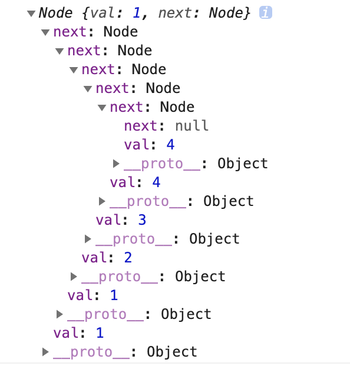

题目：将两个升序链表合并为一个新的<strong>升序</strong>链表并返回。新链表是通过拼接给定的两个链表的所有节点组成的。 

分析：我们首先要创建俩个链表，然后比较俩个链表元素的大小，然后合并为一个新的链表。

```
//  创建链表节点
function Node (val) {
    //  链表元素
    this.val = val
    //  链表元素的指向
    this.next = null
}
//  创建链表
function NodeList () {
    //  表示链表的长度
    this.length = 0
    //  表示链表的头节点
    this.head = null
}
//  实现向列表中添加元素的方法
NodeList.protoType.append = function (data) {
    var node = new Node(data)
    if (!this.head) {
        //  如果不存在头节点，把当前节点作为头节点
        this.head = node
    } else {
        //  如果存在头节点就将每个节点都指向下一个节点
        //  最后将新节点追加到最后
        let current = this.head
        while(current.next) {
            current.next = current
        }
        current.next = node
    }
    this.length++
}
//  创建返回链表的方法
function getList (arr) {
    if (!arr.length) {
        return
    }
    let list = new NodeList()
    for (let i = 0;i < arr.length;i++) {
        list.insert(arr[i])
    }
    return list
}
let l1 = getList([1,2,4])
let l2 = getList([1,3,4])
```
这里我们就得到了俩个链表l1和l2，应该是这样的：

`注意：在写append方法的时候，请不要用箭头函数，箭头函数没有this,会造成错误，本人开发时犯了这样的错，找了很久...`
有了这俩个链表，我们可以进入正题，合并这俩个链表，最终得出结果：`[1,1,2,3,4,4]`:
```
let mergeTwoLists = (l1,l2) => {
    if (l1 === null) {
        return l2
    } else if (l2 === null) {
        return l1
    } else if (l1.val < l2.val) {
        l1.next = mergeTwoLists(l1.next, l2)
        return l1
    } else if (l1.val > l2.val) {
        l2.next = mergeTwoLists(l1, l2.next)
        return l2
    }
    return []
}
mergeTwoLists(l1.head, l2.head)
```
合并后的链表是这样的。

揭下来，转化为正常的数组：
```
let arrFormat = (data) => {
    let current = data.next
    let arr = []
    while(current) {
        arr.push(current.val)
        current = current.nex
    }
}
arrFormat(mergeTwoLists(l1.head, l2.head))
//  [1,1,2,3,4,4]
```
至此，完整的链表合并完成，在js中本身没有链表这一数据结构，所以，模拟了链表，链表有俩个属性，val(值)和next(指针)俩个属性。
That's all!