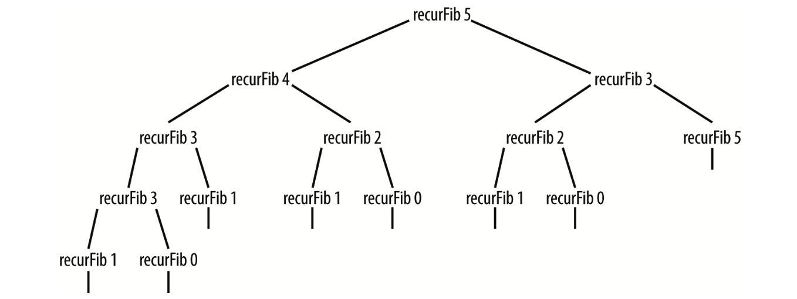

题目：写一个函数，输入n,求斐波那契数列的第n项，即F(n)斐波那契数列的定义如下，F(0) = 0, F(1) = 1, F(n) = F(n - 1) + F(n - 2)(n>1), 既： 0，1，1，2，3，5，8，13，21，44，65...

分析：斐波那契数列数列，是1202年由意大利数学家提出，用来描述兔子的增长过程发明的，既该序列是由前两项数值相加而成的。

所以，简单的代码实现就是递归：

```
let fib = n => {
    if (n < 2) {
        return n
    } else {
        return fib(n - 1) + fib(n - 2)
    }
}
fib(0) //   0
fib(1) //   1
fib(2) //   1
fib(5) //   5
fib(6) //   8
fib(10) //   55
```

我们可以看到代码实现非常的简单，但是存在的问题是执行效率太低了。从上图中可以看到，递归树中太多的值被重新计算。那么如何提高该数列的执行效率呢？答案是动态规划。来看下面的具体代码：
```
let fib = n => {
    let val = []
    for (let i = 0; i <= n;i++) {
        val[i] = 0
    }
    if (n === 1 || n === 2) {
        return 1
    } else {
        val[1] = 1
        val[2] = 2
        for (var i = 3; i <= n; ++i) {
            val[i] = val[i-1] + val[i-2]
        }
        return val[n-1]
    }
}
fib(0) //   0
fib(1) //   1
fib(2) //   1
fib(5) //   5
fib(6) //   8
fib(10) //   55
```
我们通过val数组来保存中间值结果来优化递归执行效率低的问题。所以这样应该是斐波那契数列的一个优化版本。That's all.