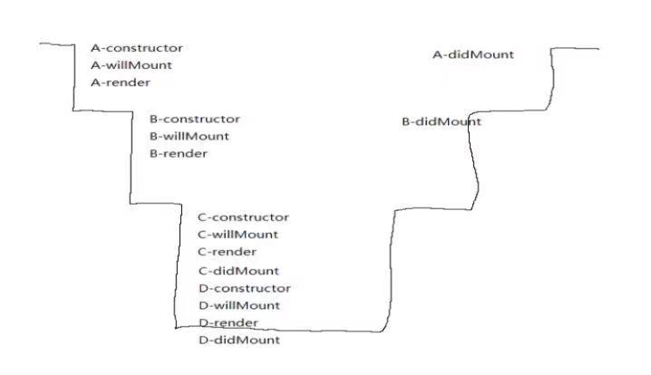
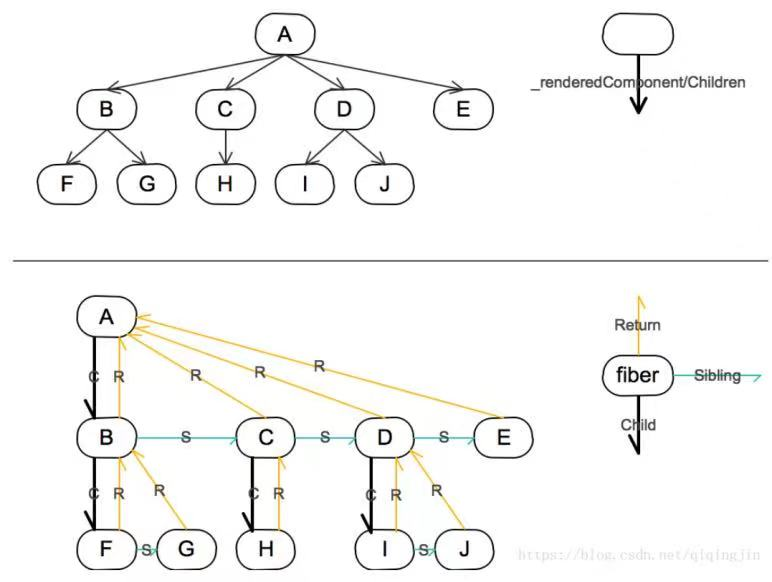

说到React，版本16将是一个较大的分水岭，尤其是在算法优化方面有了很大的更新，之前是stack算法而之后改成了fiber算法。
### stack算法的问题
在react一切都是组建的思想下，多层组建嵌套将会是一个非常常见的操作，那么生命周期的执行将会非常的繁琐。即，
+ 挂在阶段：
constructor
componentWillMount
render
componentDidMount
+ 更新阶段
shouldComponentUpdate
componentWillUpdate
render
componentDidUpdate

从顶层组件一直往下，知道最底层组建，然后再往上，组件的更新阶段也是同理。stack算法底层使用递归，而递归的方式并不会被轻易打断。那么如果组件的嵌套较深，那么递归的运算就会一直在运行，这样，react的渲染一直会占用着浏览器的主线程，这将会花费很长的时间。那么页面中的其他操作就会无法进行，出现页面卡死的现象。
### fiber算法原理
为了解决stack算法的问题，新版本的react采用了fiber算法，大致是这样做的，就是react将任务分成若干个片段，给每个任务分配一定的时间去执行这个任务，当时间耗尽后，就会检查任务列表中有没有新的或者是优先级更高的任务，如果有执行此任务，如果没有，就继续执行原来的任务。这种方式就是一步渲染的方式。加入fiber的react组件更新分为俩个阶段，以render为界，之前为phase1,之后为phase2。
+ phase1阶段
phase1阶段的生命周期是可中断的。每隔一段时间，就会跳出现有的渲染进程去确定是不是有新的，更重要的任务需要执行，主要是通过requestIdleCallback来构建新的tree，标出重要任务，放入到任务队列中。
+ phase2阶段
phase2阶段的生命周期是不可被中断的。这个阶段就是在render之后执行的，主要就是将phase1阶段的变更一次性的全部更新到DOM上。所以phase1阶段一定是一个完成的任务，否则就会重新再次执行phase1的阶段，这也就导致了某些生命周期可能会执行多次的原因。所以最好保证phase1阶段都做同一件事儿，要不然就会出问题，因此最好都是纯函数。

### fiber数据结构
fiber数据结构本质上是一个链表，他有child和sibling属性，指向第一个子节点和相邻兄弟节点，从而构成fiber树，return属性指向其父节点。更新队列updateQueue是一个链表，有first和last属性指向第一个和最后一个update对象，每个fiber结构都有updateQueue属性，指向其更新的队列。每一个fiber都有一个alternate属性开始的时候指向一个自己的clone体，更新的时候会先更新这个alternate,然后通过alternate取代当前的fiber.

### 关键API--requestIdleCallback
window.requestIdleCallback()方法将浏览器空闲时间段内的调用的函数排队。这使得主事件循环上执行后台和低优先级的工作。而不会影响延迟关键事件，如动画和输入响应。函数一般会按照先进先出的顺序执行。而如果回调函数指定执行超时，则有可能为了超时执行函数而打乱执行顺序，那么就可以在空闲回调函数中调用requestIdleCallback(),以便下一次通过时间循环之前调度另外一个回调。

### 总结
fiber算法和stack算法，做的优化主要是把任务才拆分成若干个小任务，可以随时控制任务开启和执行，采用异步的方式去执行任务。这样不会丢贞，而stack算法采用递归算法，无法中断，一条道走到黑，因此在动画等要求高的情况下，会出现卡顿现象。