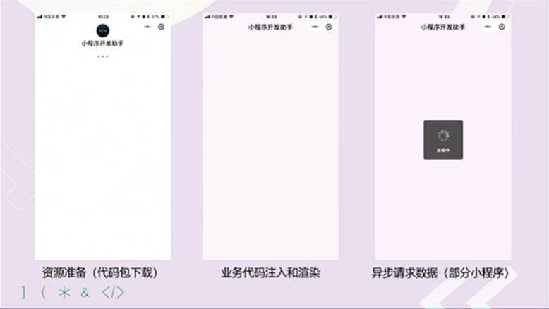

小程序开发，累代码，打页面容易，但是当小程序越来越大的时候，性能是一个非常严峻的问题。所以，我们来讲讲小程序的性能优化--分包管理。

###  微信小程序的加载顺序

小程序的加载流程主要是分三个步骤：
+ 资源准备，小程序在准备下载资源包；
+ 业务代码注入和渲染，就是说小程序开始将业务代码注入到视图层和逻辑层，然后开始渲染页面；
+ 异步数据请求，就是当进入首页如果有数据请求，那么现在开始异步数据加载。

那么，我们优化应该重点从这三步中开始。
### 代码包大小的优化
代码包的大小直接影响到小程序的启动速度，代码包体积越大，下载资源的速度就越慢，代码注入的时间，所以控制代码包的大小就会非常的有必要。
（1）控制包的大小
+ 开发完成之后，通过开发者工具上传代码，可以打开代码自动压缩的配置，这样可以将包的体积变小，另外也可以通过webpack,gulp等第三方工具压缩代码；
+ 将没有用的代码，文件等及时删除，清理，也可以减少包的体积；
+ 要尽量将图片等资源文件放到CDN上，因为小程序对于资源文件的压缩非常有限。

（2）分包加载
若果不做分包加载，那么当我们第一次打开小程序的时候，就要将小程序的所有包都下载下来，这时候，那些暂时用不到的包就会导致包下载耗时，所以，我们可以将资源做分包处理，例如将tab页面的包作为主包先下载下来，其他包作为分包，按需加载，这样打开小程序的就能稍微快一点。这样做的优势有：
+ 承载更多功能：小程序单个代码包的体积上限为 2M，使用分包可以提升小程序代码包总体积上限，承载更多的功能与服务。
+ 降低代码包下载耗时：使用分包后可以显著启动时需要下载的代码包大小，在不影响功能正常使用的前提下明显提升启动耗时。
+ 降低开发者代码注入耗时：小程序启动时会一次性注入全部的开发者代码，使用分包后可以降低注入的代码量，从而降低注入耗时。
+ 降低页面渲染耗时
但是，分包加载也有局限性，那就是用户首次打开分包的页面的时候，需要先进行代码包的下载和注入，这样就会出现一定的延时。
```
//  app.json中配置
{
    "pages":[
        "pages/index",
        "pages/logs"
    ],
    "subpackages": [
        {
            "root": "packageA",
            "pages": [
                "pages/cat",
                "pages/dog"
            ]
        }, {
            "root": "packageB",
            "name": "pack2",
            "pages": [
                "pages/apple",
                "pages/banana"
            ]
        }
    ]
}

```
分包主要是将分包的页面放到subpackages配置项中。

（3）分包预加载
因为分包加载的局限性。所以可以预加载小程序的分包。也就是说，在主包加载完成之后，静默开启分包的加载和注入。这是个无感的过程。`分包预加载需要注意的是：同一个分包中的页面享有共同的预下载大小限额2M，限额会在工具中打包时校验，因此不能把所有的分包页面都配置到分包预加载的配置中，只配置主包页面会跳转的页面即可。`
```
//  app.js中配置
{
    "pages": ["pages/index"],
    "subpackages": [
        {
            "root": "important",
            "pages": ["index"],
        },
        {
            "root": "sub1",
            "pages": ["index"],
        },
        {
            "name": "hello",
            "root": "path/to",
            "pages": ["index"]
        },
        {
            "root": "sub3",
            "pages": ["index"]
        },
        {
            "root": "indep",
            "pages": ["index"],
            "independent": true
        }
    ],
    "preloadRule": {
        "pages/index": {
            "network": "all",
                "packages": ["important"]
            },
            "sub1/index": {
                "packages": ["hello", "sub3"]
            },
            "sub3/index": {
                "packages": ["path/to"]
            },
            "indep/index": {
                "packages": ["__APP__"]
            }
        }
    }
}
```
分包预加载主要是preloadRule中，key 是页面路径，value 是进入此页面的预下载配置。

（4）独立分包
从分包页面启动时，必须依赖于主包的下载和注入，启动所以就会收到主包大小的限制，因此，我们就需要独立分包，这样在启动页面的时候，就可以不依赖于主包，减少了主包的下载和注入时间，通常会将广告，活动等具有独立逻辑的代码做独立分包。

```
//  app.json中配置
{
    "pages": [
        "pages/index",
        "pages/logs"
    ],
    "subpackages": [
        {
        "root": "moduleA",
        "pages": [
            "pages/rabbit",
            "pages/squirrel"
        ]
        }, {
        "root": "moduleB",
        "pages": [
            "pages/pear",
            "pages/pineapple"
        ],
        "independent": true
        }
    ]
}
```
独立分包通过在app.json的subpackages字段中对应的分包配置项中定义independent字段声明对应分包为独立分包。

### 代码注入的优化
（1）减少启动过程中的同步调用
在小程序的启动过程中，会依次调用App.onLaunch, App.onShow, Page.onLoad, Page.onShow生命周期函数。应避免执行复杂的计算逻辑或过度使用Sync结尾的同步API。对于 getSystemInfo, getSystemInfoSync 的结果应进行缓存，避免重复调用。

（2）使用依赖注入
通常情况下，在小程序启动时，启动页面所在分包和主包（独立分包除外）的所有JS代码会全部合并注入，包括其他未访问的页面以及未用到自定义组件，造成很多没有使用的代码注入到小程序运行环境中，影响注入耗时和内存占用。
自基础库版本 2.11.1 起，小程序支持仅注入当前页面需要的自定义组件和当前页面代码，以降低小程序的启动时间和运行时内存。开发者可以在 app.json配置：
```
//  app.json配置
{
  "lazyCodeLoading": "requiredComponents"
}

```
`注意：添加这项配置后，未使用到的代码文件将不被执行。`

### 页面渲染优化
（1）提高首屏渲染速度
大部分小程序在渲染首页时，需要依赖服务端的接口数据，小程序为开发者提供了提前发起数据请求的能力：
+ 数据预拉取：能够在小程序冷启动的时候通过微信后台提前向第三方服务器拉取业务数据，当代码包加载完时可以更快地渲染页面，减少用户等待时间，从而提升小程序的打开速度。
+ 周期性更新：在用户未打开小程序的情况下，也能从服务器提前拉取数据，当用户打开小程序时可以更快地渲染页面，减少用户等待时间。

（2）骨架屏
页面数据未准备好之前，避免长时间白屏，可以使用骨架屏来显示页面结构。提升用户等待的意愿。

（3）缓存数据
小程序提供了wx.setStorage、wx.getStorage等读写本地缓存的能力，数据存储在本地，返回的会比网络请求快。如果开发者基于某些原因无法采用数据预拉取与周期性更新，我们推荐优先从缓存中获取数据来渲染视图，等待网络请求返回后进行更新。

（4）精简首屏数据
我们推荐开发者延迟请求非关键渲染数据，与视图层渲染无关的数据尽量不要放在 data 中，加快页面渲染完成时间。

### 运行时性能优化

#### setData
小程序中setData的调用是最为频繁的。也是最容易引起性能问题的接口。

##### setData的工作原理
`小程序的视图层目前使用 WebView 作为渲染载体，而逻辑层是由独立的 JavascriptCore 作为运行环境。在架构上，WebView 和 JavascriptCore 都是独立的模块，并不具备数据直接共享的通道。当前，视图层和逻辑层的数据传输，实际上通过两边提供的 evaluateJavascript 所实现。即用户传输的数据，需要将其转换为字符串形式传递，同时把转换后的数据内容拼接成一份 JS 脚本，再通过执行 JS 脚本的形式传递到两边独立环境。而 evaluateJavascript 的执行会受很多方面的影响，数据到达视图层并不是实时的。`

##### setData的错误使用
1. 频繁调用setData
+ Android 下用户在滑动时会感觉到卡顿，操作反馈延迟严重，因为 JS 线程一直在编译执行渲染，未能及时将用户操作事件传递到逻辑层，逻辑层亦无法及时将操作处理结果及时传递到视图层；
+ 渲染有出现延时，由于 WebView 的 JS 线程一直处于忙碌状态，逻辑层到页面层的通信耗时上升，视图层收到的数据消息时距离发出时间已经过去了几百毫秒，渲染的结果并不实时；

2. 每次 setData 都传递大量新数据
由setData的底层实现可知，我们的数据传输实际是一次 evaluateJavascript 脚本过程，当数据量过大时会增加脚本的编译执行时间，占用 WebView JS 线程.

3. 后台态页面进行 setData
当页面进入后台态（用户不可见），不应该继续去进行setData，后台态页面的渲染用户是无法感受的，另外后台态页面去setData也会抢占前台页面的执行。

#### 图片资源
目前图片资源的主要性能问题在于大图片和长列表图片上，这两种情况都有可能导致 iOS 客户端内存占用上升，从而触发系统回收小程序页面。在 iOS 上，小程序的页面是由多个 WKWebView 组成的，在系统内存紧张时，会回收掉一部分 WKWebView。从过去我们分析的案例来看，大图片和长列表图片的使用会引起 WKWebView 的回收。除了内存问题外，大图片也会造成页面切换的卡顿。我们分析过的案例中，有一部分小程序会在页面中引用大图片，在页面后退切换中会出现掉帧卡顿的情况。当前我们建议开发者尽量减少使用大图片资源。
