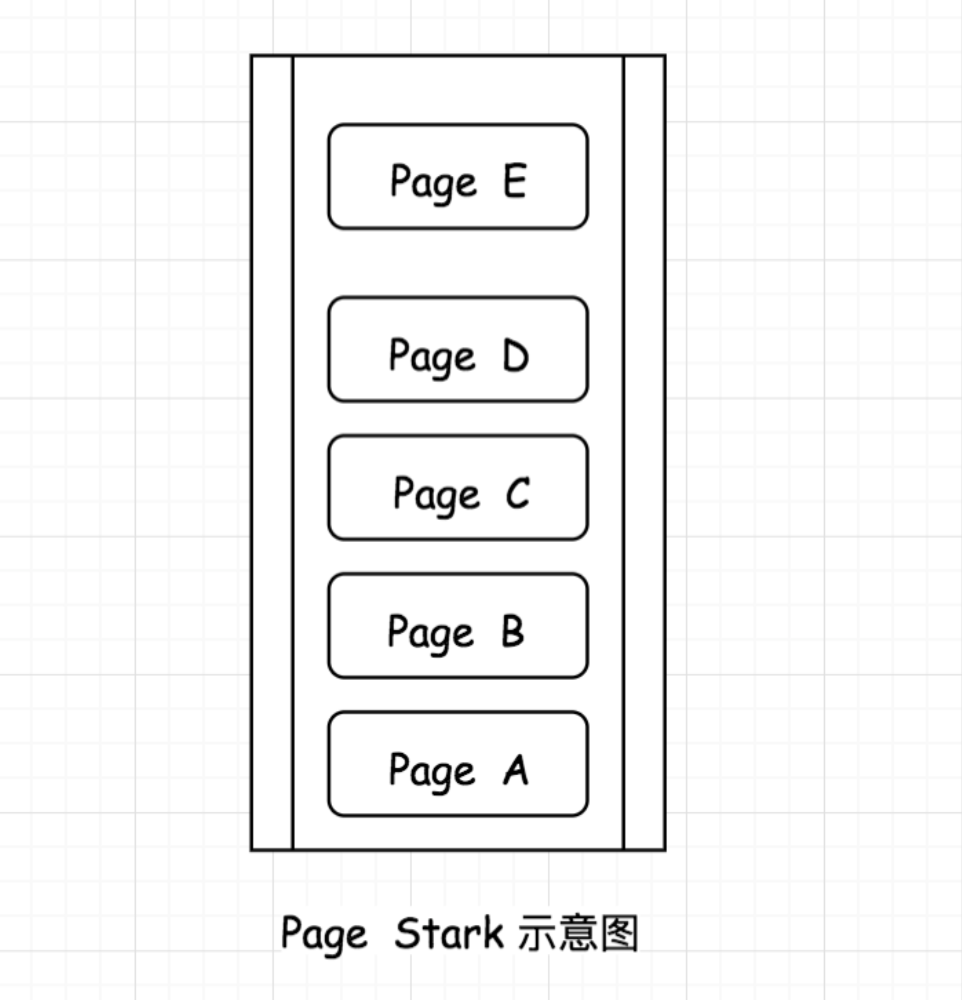
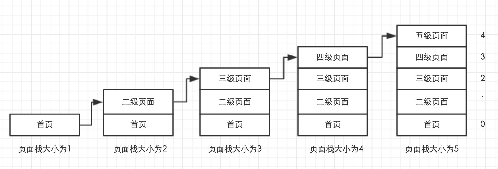
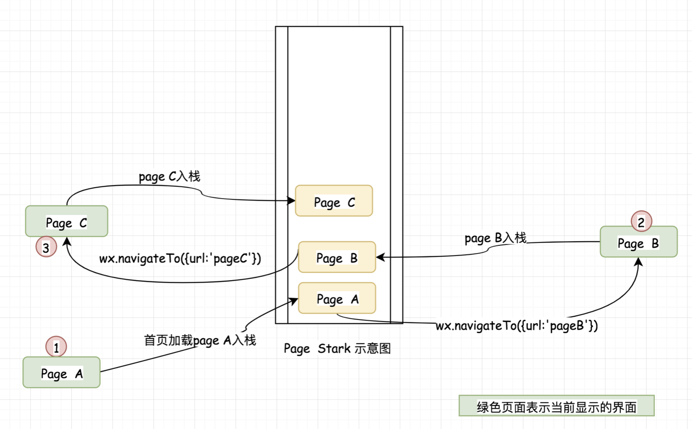
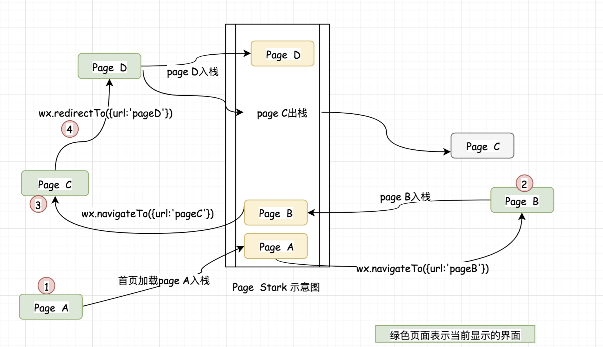
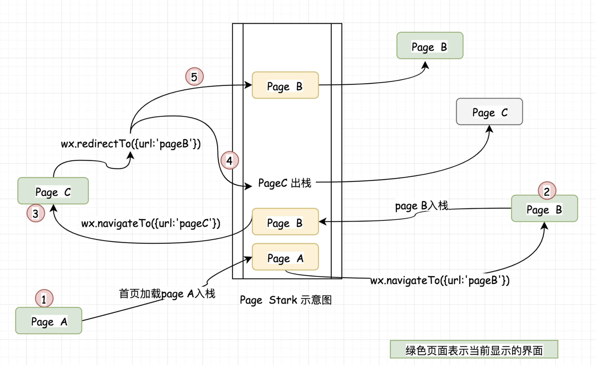
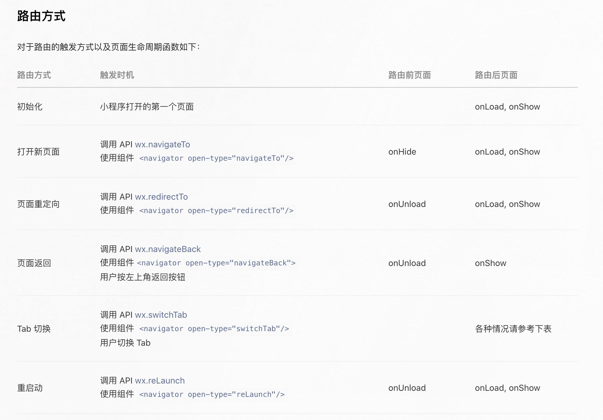

最近在开发微信小程序，因为业务需要，页面跳转比较多，总是会出现连续跳转多次后，不能再跳转，或者是屏幕向右滑动回退不能到想要的页面等问题，这都是因为小程序路由栈管理的问题。在微信的官方文档中有五个方法,我们就来总结一下这五个方法的用法，以及遇到的一些坑：

+ wx.switchTab(Object object)：switchTab这个方法比较好理解，它主要是用来tab页面的跳转，并且此时会关闭其他非tab的页面；
+ wx.reLaunch(Object object)：可以跳转到任意的页面；
+ wx.navigateTo(Object object)：正常的页面跳转，上一个页面会保留；
+ wx.redirectTo(Object object)：页面重定向，上一个页面会被关闭，不能返回；
+ wx.navigateBack(Object object)：页面回退到上一个页面，关闭当前页面。

下面介绍小程序的栈情况：
小程序的想要管理小程序的页面，小程序是通过本身创立的一个小程序栈来管理的。如图：

我们知道，栈是遵循先进先出的规则，所以小程序官方提供了getCurrentPages()的方法来获取小程序的栈结构，第一个元素为首页，最后一个元素为当前页面，下程序规定栈中最多存放5个页面。

当页面中的栈大于5之后，使用wx.navigateTo()就不会再跳转页面。我们需要明白的一个重要问题就是，当客户按返回按钮的时候究竟会跳转到那个界面，这是我们分析页面栈变化的的意义。首先我们在页面中调用两次navigateTO，页面栈情况如下。

这时显示的界面是pageC ，如果客户在此时返回则会一切正常，回退的第一个界面是pageB，然后是pageA。但是如果在pageC 界面调用  wx.redirectTo({url:'pageD'}) 则情况就会不一样了，我们先看一下跳转到pageD后页面栈的情况如何。

根据栈的情况，我们可以分析出。如果使用 wx.redirectTo跳转到pageD页面，然后在回退的时候是不能再次回退到pageC的，而会直接回退到pageB。
通过上面对页面栈的分析，我们可以看到栈的变化是会影响客户回退页面的顺序的，所以根据自己的需要合理的使用不同的跳转方法是非常重要的。如果使用不当就会导致跳转混乱让人摸不清头脑。
下面分析一种调转重复页面的情况。如果我们的pageB页面是一个数据列表页面，比如商品列表，pageC是一个商品的编辑界面，一般我们会通过pageB然后进如pageC对商品进行修改，修改后返回pageB。这是很常见的一个场景，但是如果使用不当机会出现如下情况：

如图所示栈中出现了两个相同的pageB界面，这个时候如果用户按退出键就会出现一个页面出现2次的情况，而且有一个界面的数据也是旧的数据。因此为了避免这个问题，我们应该在 PageC 页面避免将 PageB重复压入栈中，所以在pageC页面 使用wx.navigateBack({delta:1}); 进行页面回退。而数据刷新的问题则在页面的onShow函数中进行即可。

Tips:
+ navigateTo, redirectTo 只能打开非 tabBar 页面。
+ switchTab 只能打开 tabBar 页面。
+ reLaunch 可以打开任意页面。
+ 页面底部的 tabBar 由页面决定，即只要是定义为 tabBar 的页面，底部都有 tabBar。
+ 调用页面路由带的参数可以在目标页面的onLoad中获取。

[更多详情。。。。](https://developers.weixin.qq.com/miniprogram/dev/framework/app-service/route.html)